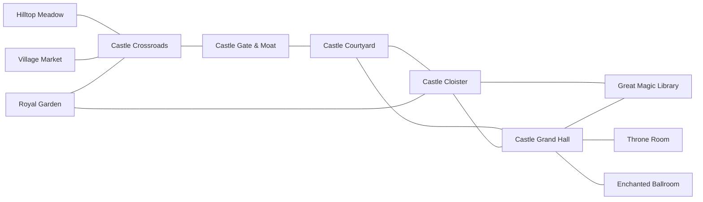

# Fantasy Relation Background Pilot Design

**Date:** 2026-07-16
**Status:** Design approved; implementation waits for specification review
**Projects:** `story-gen-exps` and `asset-editor-fabrolabs`

## 1. Purpose

The current Fantasy backgrounds are useful locations, but they behave as a flat list. A story can jump from a market to a throne room without any spatial explanation. This pilot adds a small, coherent location graph so characters can move through visible paths, doors, arches, halls, and gardens while retaining multiple possible routes through the same world.

The pilot will:

- reuse existing Fantasy live backgrounds as anchors;
- generate only three new hub/bridge backgrounds;
- let one background connect to several others;
- constrain authored scene-to-scene location changes to valid graph edges;
- use route metadata to make entries and iris transitions spatially consistent;
- preserve the existing flat background behavior behind a default-off feature flag.

The core design choice is a **hybrid graph**: keep strong existing backgrounds, add a few deliberately designed connector backgrounds, and store relationships in a separate world-level sidecar. This yields substantially more route combinations than generating isolated one-to-one background pairs.

## 2. Scope

### In scope

- A Fantasy Kingdom-only pilot.
- Eight selected existing live backgrounds plus three new live backgrounds.
- Many-to-many connectivity through shared hubs.
- One unambiguous route for each ordered pair of adjacent backgrounds.
- Graph-aware story prompting and validation.
- Route-aware character entry side and iris transition centers.
- Gemini generation of two candidates for each new background.
- Deterministic live-background animation, source bundles, targeted publishing, manifest registration, and editor rerender compatibility.

### Out of scope

- The other seven worlds.
- A full graph editor UI.
- Multiple distinct routes between the same ordered background pair.
- Adding a route identifier to the LLM-authored story payload.
- Forced character walking at the end of every scene; this would change shot timing and is deferred.
- Replacing or renaming existing background assets.
- Making day and night versions share one identity.
- WAN v2 generation or upload.
- Broad republishing of existing live backgrounds.

## 3. Pilot World Graph

### Existing anchor nodes

| Slug | Role |
|---|---|
| `fk_hilltop_meadow_live` | Open-world starting point |
| `fk_village_market_live` | Village starting point |
| `fk_castle_gate_moat_live` | Castle exterior threshold |
| `fk_castle_courtyard_live` | Castle exterior hub |
| `fk_royal_garden_live` | Nature/castle crossover |
| `fk_throne_room_crown_live` | Royal destination |
| `fk_great_magic_library_live` | Knowledge/magic destination |
| `fk_enchanted_ballroom_live` | Celebration destination |

### New connector nodes

| Slug | Role | Required visible connections |
|---|---|---|
| `fk_castle_crossroads_live` | Exterior world hub | Separate market, meadow, garden, and castle-gate paths |
| `fk_castle_grand_hall_live` | Interior castle hub | Courtyard doors, cloister arch, throne door, library door, ballroom stair/door |
| `fk_castle_cloister_live` | Semi-exterior crossover hub | Courtyard arch, garden arch, library side door, grand hall arch |

### Edges

Every edge below is explicitly bidirectional for the pilot. Bidirectionality must be recorded in data rather than inferred from the visual.

| A | Relation | B |
|---|---|---|
| Hilltop Meadow | path to | Castle Crossroads |
| Village Market | path to | Castle Crossroads |
| Royal Garden | path to | Castle Crossroads |
| Castle Crossroads | path to | Castle Gate & Moat |
| Castle Gate & Moat | enter | Castle Courtyard |
| Castle Courtyard | enter | Castle Grand Hall |
| Castle Courtyard | archway | Castle Cloister |
| Royal Garden | archway | Castle Cloister |
| Castle Cloister | archway | Castle Grand Hall |
| Castle Cloister | side door | Great Magic Library |
| Castle Grand Hall | door | Great Magic Library |
| Castle Grand Hall | door | Throne Room |
| Castle Grand Hall | stair or door | Enchanted Ballroom |



The three new nodes intentionally have high degree:

- Castle Crossroads: 4 neighbors.
- Castle Grand Hall: 5 neighbors.
- Castle Cloister: 4 neighbors.

This creates combinatorial value without a large asset count. Valid examples include:

- Meadow → Crossroads → Gate → Courtyard → Grand Hall → Throne Room.
- Market → Crossroads → Garden → Cloister → Library.
- Garden → Cloister → Courtyard → Grand Hall → Ballroom.
- Library → Cloister → Courtyard → Gate → Crossroads → Market.
- Throne Room → Grand Hall → Library → Cloister → Garden.
- Ballroom → Grand Hall → Courtyard → Gate → Crossroads → Meadow.

Story planning uses a compressed setting sequence: consecutive scenes in the same background collapse to one node. The compressed sequence must be a simple path of three to six nodes. Consecutive same-setting scenes remain valid, but returning to a node after leaving it is a rejected revisit in this pilot.

## 4. Relationship Data Model

Relationships are edge data, not properties of one background plate. They will therefore live in a tracked sidecar in `story-gen-exps`, not in `BackgroundAsset` and not under its generated/ignored asset tree.

Planned file:

`backend/engine/world_graphs/fantasy_kingdom.json`

Version 1 shape:

```json
{
  "version": 1,
  "world_id": "fantasy_kingdom",
  "nodes": [
    "fk_hilltop_meadow_live",
    "fk_castle_crossroads_live"
  ],
  "routes": [
    {
      "id": "meadow_crossroads_path",
      "from": "fk_hilltop_meadow_live",
      "to": "fk_castle_crossroads_live",
      "bidirectional": true,
      "relation": "path_to",
      "exit": {
        "zone": "floor",
        "screen_zone": "right_edge",
        "center_pct": [88, 58],
        "landmark_ids": ["castle_path"]
      },
      "entry": {
        "zone": "floor",
        "screen_zone": "left_edge",
        "center_pct": [12, 58],
        "landmark_ids": ["meadow_path"]
      }
    }
  ]
}
```

Required route fields are `id`, `from`, `to`, explicit `bidirectional`, `relation`, `exit`, and `entry`. Each endpoint contains a logical asset zone, a symbolic screen zone, a normalized percentage center, and optional stable landmark identifiers.

`center_pct` uses a top-left origin and contains `[x, y]` values in the inclusive range `0..100`. `screen_zone` reuses the engine's `ScreenZone` symbols, but pilot route entries are restricted to `left_edge`, `left_third`, `right_third`, or `right_edge`; `center` is invalid for an entrance. Left zones map deterministically to `hero_entrance_side="left"` and right zones to `"right"`. The endpoint's `zone` must name a real zone declared by that background's active manifest entry.

The pilot supports only one route per ordered pair. The engine can infer that route from two consecutive background slugs, so the authoring model does not need to emit `route_id`. If distinct doors later connect the same pair, the story schema and authoring flow can be versioned deliberately.

## 5. Engine Integration

### Loader and resolver

Add a focused typed module at `backend/engine/world_graphs.py` with these responsibilities:

- `graph_for(world_id)` loads and validates a versioned graph.
- `route_between(world_id, from_slug, to_slug)` returns a directed view of one edge.
- `graph_backgrounds(world_id)` returns nodes in stable sidecar order.
- A neighbor helper supports prompts, validation, and diagnostics.

The reverse view of a bidirectional route swaps its entry and exit endpoint metadata. Missing, malformed, or unsupported graph data must fail open to the current flat behavior and produce a useful diagnostic log without stopping ordinary story generation.

### Feature flag

Add `ENGINE_V5_WORLD_GRAPH=false` as a default-off flag.

When the flag is off, all existing behavior remains unchanged. When it is on for Fantasy Kingdom:

- `real_backgrounds` returns graph nodes in graph order, filtered against the active manifest, rather than capping the first eight entries.
- `world_context_text` and `all_worlds_asset_facts` append a compact adjacency list.
- `fantasy_storyteller.md` uses the graph-provided palette and route rules rather than a conflicting hardcoded eight-background list.
- `_world_checks` requires every distinct Fantasy setting to be a graph node.
- `_world_checks` validates each pair of consecutive, distinct settings after sorting scenes by `scene_id`.
- A same-setting repeat remains valid.
- A missing edge rejects the draft with `disconnected_background_route` and lists valid next neighbors so repair is actionable.
- The compressed setting sequence must contain three to six nodes and may not revisit a departed node; path-length and revisit failures receive separate repairable diagnostics.

The pilot graph is all-or-nothing rather than an induced partial subgraph. If any of its eleven declared nodes, any route endpoint, or any referenced manifest zone is unavailable, graph mode for Fantasy fails open to the complete legacy flat behavior. A newly generated node is therefore not advertised until all three new assets are published, registered, retrievable, and the entire graph validates.

### Ownership compatibility

`StoryWorld.background_slugs`, `world_for_setting`, and `world_id_for_background` remain the ownership and fallback mechanisms. The three new slugs are added to Fantasy ownership only after successful publishing. This avoids breaking current journey work and preserves non-graph callers.

No relation fields are added to `BackgroundAsset`. Doing so would duplicate bidirectional edges and force every local scan, remote scan, manifest builder, publisher, and registration path to preserve graph semantics.

## 6. Route-Aware Staging and Rendering

The runner already compiles scenes in story order and is the correct seam for resolving incoming and outgoing routes. It will pass optional route information into scene compilation without changing existing callers.

Planned additive fields, all with legacy-safe defaults:

- incoming and outgoing route identifiers;
- `hero_entrance_side`, using the field already present in staging;
- optional `hero_exit_side`;
- `transition_in_center_pct`;
- `transition_out_center_pct`.

Behavior:

1. The incoming route's entry screen zone determines the hero entrance side through the fixed left/right mapping above.
2. The current left-side entrance remains the fallback when route data is absent.
3. The opening iris centers near the incoming route's entry landmark.
4. The closing iris centers near the outgoing route's exit landmark.
5. Route transition centers are inert when per-scene transitions are disabled.
6. The pilot does not force an end-of-scene walking exit. Exit metadata initially controls the closing iris only.

With the flag off or no graph route available, output must retain the current defaults and remain compatible with old serialized run data.

## 7. New Background Art Direction

### Route endpoint matrix gate

Before any Gemini request, sample clear frames from every related existing live background and complete all thirteen edges' endpoint matrix: route ID, both background slugs, real manifest zone, permitted screen zone, exact `center_pct`, and stable visible landmark ID on each side. Metadata may only target a visibly plausible path, door, arch, or frame edge already present in an existing plate; it must not invent an invisible exit. If an anchor lacks a compatible endpoint, revise that edge or the connector composition before generation. This matrix becomes the source for the final graph JSON and is reviewed together with the prompts.

### Shared visual lock

All three new backgrounds must match the existing Fantasy Kingdom rather than merely share a generic fantasy style:

- kid-friendly 2D storybook illustration;
- clean dark outlines and soft cel shading;
- matching pale stone, blue conical roofs, timber details, and red/gold/blue banners;
- 16:9, 2K source, locked wide camera;
- lower 40% kept as a clear, flat character stage;
- route exits visible at the authored screen positions;
- no people, animals, text, logos, baked-in moving objects, random extra buildings, or center-stage obstruction;
- shared landmarks keep the same material, color, and architectural identity across related images.

### Castle Crossroads

References: Hilltop Meadow, Village Market, Castle Gate & Moat.

Composition: a readable four-way exterior junction with separate branches for the timber-roof market, hilltop meadow, royal garden, and recognizable blue-roofed gate and moat. The four traversable branches occupy the four permitted left/right screen zones rather than center, while the lower foreground remains playable.

### Castle Grand Hall

References: Castle Courtyard, Throne Room, Great Magic Library.

Composition: a wide interior hub with courtyard doors, a distinct cloister arch/side gallery, a visually distinct throne-room door, a library door, and a ballroom stair or door. Every traversable entrance sits in an allowed left or right screen zone even if a non-traversable visual focal point remains near center. Door colors, arch materials, and floor patterns become stable reciprocal landmarks.

### Castle Cloister

References: the approved Castle Grand Hall candidate, Royal Garden, and Great Magic Library. Grand Hall is generated and selected first so its cloister arch can become the reciprocal visual reference.

Composition: a semi-exterior arched gallery with a courtyard arch, a garden/fountain glimpse, a recognizable library side door, and a grand-hall arch. The arches must read as traversable connections without crowding the stage.

## 8. Gemini and Live-Background Pipeline

Generation belongs in `story-gen-exps`; `asset-editor-fabrolabs` remains a deterministic, no-LLM rerendering tool.

Use an isolated pilot helper, planned as `scripts/v5_fantasy_relation_bgs.py`, to avoid broad changes to currently modified pipeline scripts. It will:

1. Load up to three approved reference images for each new node, following the Grand Hall to Cloister dependency above.
2. Call `gemini-3-pro-image` with an explicit 16:9, 2K image configuration and the locked art-direction prompt.
3. Generate two independent candidates per node, six candidates total.
4. Cache each candidate separately and never overwrite an existing slug or cache.
5. Stop for visual selection before publishing.
6. Feed the chosen plate into the deterministic `v5_livebg` renderer.
7. Add only subtle code-driven movers such as flags, clouds, or sparkles; no WAN animation.
8. Produce a 1920×1080 H.264 MP4 at 24 FPS, approximately 24 seconds long, plus the complete source bundle.
9. Publish only the selected pilot asset through a targeted single-scene path.

The Gemini API key is read only from `GEMINI_API_KEY` in the process environment. It must never be written into source, prompts, generated metadata, logs, caches, sidecars, tests, or commits.

## 9. Failure Handling and Safe Publishing

- Missing `GEMINI_API_KEY`: stop before any API request and explain how to set the process environment.
- Quota, timeout, or empty image result: perform bounded retries and resume from per-candidate cache.
- Candidate fails visual QA: do not publish it; regenerate using the same references and a refined constraint prompt.
- Missing source-bundle component: block upload.
- Missing graph node, route endpoint, or manifest zone: disable Fantasy graph mode as a unit and fail open to flat mode.
- Partial storage/network failure: do not enable the graph until all three assets are registered and retrievable.
- Existing asset conflict: abort rather than overwrite.
- Never invoke a broad publisher that could transcode, replace, or delete legacy assets.

Publishing order is plate selection → deterministic render → bundle verification → targeted upload → manifest rebuild/registration → process/cache refresh → graph enablement.

## 10. Verification

### Automated tests

Add `tests/engine_v5/test_world_graphs_v5.py` covering:

- unique node and route identifiers;
- uniqueness of every expanded directed `(from_slug, to_slug)` pair, including reverse edges created by `bidirectional`;
- every route endpoint resolves to a graph node;
- endpoint zones and percentages are valid;
- explicit bidirectional reversal swaps entry and exit correctly;
- graph connectivity;
- required high-degree connector nodes;
- missing or malformed sidecar fail-open behavior;
- flag-off compatibility.

Extend existing world, staging, render, and iris tests to cover:

- graph-based Fantasy palette retrieval;
- acceptance of valid consecutive routes;
- rejection and repair information for disconnected transitions;
- same-background repeat acceptance;
- rejection of a compressed path outside three to six nodes or one that revisits a departed node;
- route-derived entrance side;
- distinct incoming and outgoing iris centers;
- unchanged legacy defaults when graph behavior is unavailable or disabled.

Run the existing engine and video regression suites after the focused tests.

### Story-level verification

Generate ten Fantasy sample stories with the feature enabled. All must be graph-valid, use simple paths, and collectively contain at least five distinct collapsed background-slug sequences. At least three graph nodes must have degree three or greater.

### Visual and media QA

For every selected new background verify:

- 16:9 2K still and 1920×1080 final video;
- matching architecture, palette, outline, and lighting language;
- coherent reciprocal paths, doors, and arches;
- clear lower 40% staging area;
- no people, animals, text, logos, or random structures;
- start, middle, and end frames preserve the locked camera;
- loop seam is acceptable and movers do not drift;
- H.264, 24 FPS, approximately 24-second output;
- bundle includes spec, plate, mover sources, and cuts;
- the asset editor can rerender it without Gemini.

## 11. Acceptance Criteria

The pilot is complete when:

- all three new live backgrounds are approved, published, present in the manifest, source-bundled, and editor-rerenderable;
- every graph endpoint resolves to a registered background and valid endpoint metadata;
- all thirteen edges have a reviewed two-sided endpoint matrix backed by visible landmarks on the actual plates;
- Crossroads, Grand Hall, and Cloister each have at least three neighbors;
- graph-enabled authoring produces only valid consecutive Fantasy transitions;
- ten sample stories achieve 100% graph validity and at least five distinct collapsed background-slug sequences;
- feature-flag-off behavior and existing tests remain unchanged;
- no Gemini credential is persisted anywhere in either repository or generated artifacts;
- current journey-related work in the dirty `story-gen-exps` tree is preserved.

## 12. Rollout and Rollback

Implementation order:

1. Add tests-first graph loading, schema validation, and feature flag behavior.
2. Add graph-aware agent context and transition validation.
3. Add optional route-aware entry and iris metadata.
4. Generate and visually select the six Gemini candidates.
5. Render, bundle, and verify the three selected live backgrounds.
6. Publish and register them through a targeted path.
7. Enable the Fantasy graph in a controlled environment and run end-to-end story checks.

Rollback is immediate: disable `ENGINE_V5_WORLD_GRAPH`. The new backgrounds are additive assets, so they may remain stored while the authoring and renderer return to flat legacy behavior.
